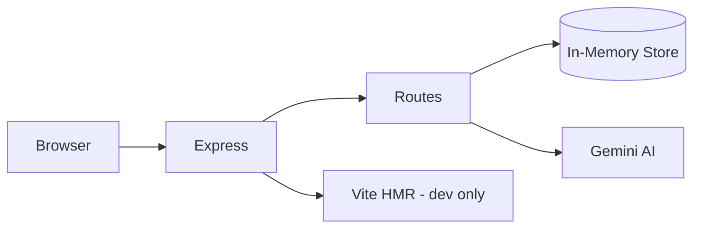

# DeepSpot — Human Deepfake Detection Gym

Gamified platform for training human pattern recognition against synthetic media manipulation. Users vote on real vs. fake challenges, earn points, climb leaderboards, and upload community challenges.

## Architecture

```
DeepSpot/
├── src/
│   ├── components/      # React SPA views & UI
│   ├── server/          # Express API
│   │   ├── routes/      # REST route handlers
│   │   ├── services/    # Gemini AI, etc.
│   │   ├── middleware/  # Error handling
│   │   └── store/       # In-memory data (Phase 1 → database)
│   ├── data/            # Seed data
│   └── types/           # Shared TypeScript types
├── server.ts            # Dev entry (re-exports src/server)
└── vite.config.ts
```



## Prerequisites

- [Node.js](https://nodejs.org/) 20+ or [Bun](https://bun.sh/)
- Optional: [Google Gemini API key](https://aistudio.google.com/apikey) for AI forensic hints

## Setup

```bash
# Install dependencies
npm install
# or: bun install

# Copy environment template
cp .env.example .env

# Add your Gemini key to .env (optional)
# GEMINI_API_KEY=your_key_here
```

## Scripts

| Command | Description |
|---------|-------------|
| `npm run dev` | Start dev server (Express + Vite HMR) at http://localhost:3000 |
| `npm run build` | Build frontend + bundle server for production |
| `npm start` | Run production build |
| `npm run lint` | TypeScript type check |
| `npm run lint:eslint` | ESLint |
| `npm run format` | Format code with Prettier |
| `npm run format:check` | Check formatting |
| `npm run clean` | Remove build artifacts |

## Environment Variables

See [`.env.example`](.env.example) for all supported variables.

| Variable | Required | Description |
|----------|----------|-------------|
| `GEMINI_API_KEY` | No | Enables AI-generated forensic hints |
| `PORT` | No | Server port (default: `3000`) |
| `NODE_ENV` | No | `development` or `production` |
| `DATABASE_URL` | No | Reserved for Phase 1 (PostgreSQL) |
| `JWT_SECRET` | No | Reserved for Phase 2 (auth) |

## API Overview

| Method | Endpoint | Description |
|--------|----------|-------------|
| GET | `/api/health` | Health check |
| GET | `/api/auth/me` | Current user |
| GET | `/api/posts` | Training feed (filterable) |
| POST | `/api/posts/:id/vote` | Cast vote |
| POST | `/api/upload` | Submit challenge |
| GET | `/api/leaderboard` | Rankings |
| GET | `/api/profile/:username` | User profile |
| GET | `/api/admin/moderation/queue` | Pending uploads |
| GET | `/api/notifications` | User notifications |

## Current Limitations (Prototype)

- **In-memory storage** — data resets on server restart
- **Single demo user** — no real authentication yet
- **Media via URLs/base64** — no cloud storage yet

See the implementation plan in project docs for Phases 1–7 (database, auth, media storage, etc.).

## Tech Stack

- **Frontend:** React 19, TypeScript, Tailwind CSS 4, Motion, Lucide
- **Backend:** Express 4, Google Gemini SDK
- **Tooling:** Vite 6, esbuild, ESLint, Prettier

## License

Capstone project — DeepSpot Arena © 2026
